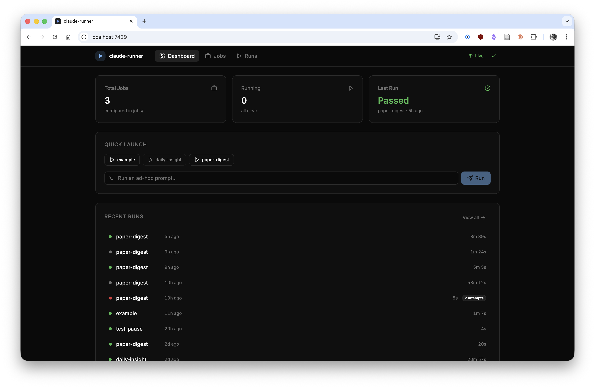

# claude-runner

A lightweight automation runner for [Claude Code](https://docs.anthropic.com/en/docs/claude-code) for macOS. Run headless Claude Code jobs on a schedule or via webhooks, using your existing Max subscription.



## How It Works

```
┌────────────────────┐     ┌────────────┐     ┌──────────────────────────────────┐
│ launchd / webhook  │────▶│  runner.sh  │────▶│  claude -p "..." --dangerously-  │
└────────────────────┘     │  retries,   │     │  skip-permissions                │
                           │  logging,   │     └──────────────────────────────────┘
                           │  ntfy.sh    │
                           └────────────┘
```

- **runner.sh** — runs a single job end-to-end with retries, logging, lockfiles, and push notifications
- **server/** — Hono API server with React mission control dashboard, SSE real-time updates, and job management
- **setup.sh** — installs launchd plists from job YAML definitions and configures Mac wake schedule
- **setup-server.sh** — installs a launchd service so the server starts on login and auto-restarts
- **delete-job.sh** — removes a job YAML and re-syncs launchd schedules
- **jobs/*.yaml** — declarative job definitions
- **jobs.local/*.yaml** — personal job definitions (gitignored, takes precedence over `jobs/`)

## Quickstart

```bash
git clone https://github.com/tbedau/claude-runner.git && cd claude-runner
cp config.local.yaml.example config.local.yaml
# Edit config.local.yaml — set auth_token to a random string
./setup-server.sh
```

Open **http://localhost:7429** — you're in.

`setup-server.sh` installs dependencies, builds the dashboard, and registers a launchd service that starts on login and auto-restarts on crash.

### Install job schedules

Jobs in `jobs/` and `jobs.local/` with a `schedule` field need launchd plists to run automatically:

```bash
./setup.sh              # installs launchd plists + configures Mac wake
./setup.sh --no-wake    # skip the pmset wake schedule
```

Re-run after adding or removing jobs via the CLI. The dashboard auto-syncs schedules when you create, edit, or delete jobs.

## Configuration

**`config.yaml`** — committed defaults:

| Key | Default | Description |
|-----|---------|-------------|
| `default_workdir` | `.` | Working directory for claude |
| `server_port` | `7429` | Server port |
| `claude_binary` | `claude` | Path to claude CLI |
| `ntfy_server` | `https://ntfy.sh` | ntfy server URL |

**`config.local.yaml`** — gitignored, your overrides:

| Key | Description |
|-----|-------------|
| `auth_token` | Bearer token protecting the dashboard and API |
| `ntfy_topic` | ntfy.sh topic for push notifications |
| `default_workdir` | Override working directory |
| *custom keys* | Any key that jobs reference via `env` |

Install the [ntfy app](https://apps.apple.com/us/app/ntfy/id1625396347) on your phone and subscribe to the same topic to receive push notifications.

## Usage

### Web Dashboard

Open **http://localhost:7429** to access Mission Control:

- **Dashboard** — stats overview, quick-trigger buttons, ad-hoc prompt input, real-time run feed
- **Jobs** — card grid of all jobs with run/pause/edit/delete actions, create new jobs
- **Job Editor** — form fields + CodeMirror YAML editor with bidirectional sync
- **Runs** — filterable run history table with pagination
- **Log Viewer** — full log output with syntax highlighting, live streaming for running jobs

Real-time updates via Server-Sent Events (SSE) — status changes and log output stream live without polling.

### CLI

```bash
# Named job (loads from jobs.local/<name>.yaml or jobs/<name>.yaml)
./runner.sh my-job

# Ad-hoc prompt
./runner.sh --prompt "List all files modified today"

# Delete a job
./delete-job.sh my-job   # removes YAML + re-syncs launchd
```

### API

All endpoints require `Authorization: Bearer <token>` header (or `?token=<token>` for SSE).

```bash
# Jobs
curl -H "Authorization: Bearer <token>" http://localhost:7429/api/jobs
curl -H "Authorization: Bearer <token>" http://localhost:7429/api/jobs/my-job
curl -X POST -H "Authorization: Bearer <token>" -H "Content-Type: application/json" \
  -d '{"name":"my-job","yaml":"name: my-job\nprompt: hello"}' http://localhost:7429/api/jobs
curl -X PUT -H "Authorization: Bearer <token>" -H "Content-Type: application/json" \
  -d '{"yaml":"name: my-job\nprompt: updated"}' http://localhost:7429/api/jobs/my-job
curl -X PATCH -H "Authorization: Bearer <token>" http://localhost:7429/api/jobs/my-job/toggle
curl -X DELETE -H "Authorization: Bearer <token>" http://localhost:7429/api/jobs/my-job

# Runs
curl -H "Authorization: Bearer <token>" http://localhost:7429/api/runs
curl -X POST -H "Authorization: Bearer <token>" http://localhost:7429/api/runs/trigger/my-job
curl -X POST -H "Authorization: Bearer <token>" -H "Content-Type: application/json" \
  -d '{"prompt":"Summarize my inbox"}' http://localhost:7429/api/runs/adhoc
curl -X POST -H "Authorization: Bearer <token>" http://localhost:7429/api/runs/kill/my-job
curl -H "Authorization: Bearer <token>" http://localhost:7429/api/runs/log/<runId>

# System
curl http://localhost:7429/api/health
curl -X POST -H "Authorization: Bearer <token>" http://localhost:7429/api/schedule/sync

# SSE stream
curl -N http://localhost:7429/api/events?token=<token>
```

## Job Definition Format

Create a YAML file in `jobs/` (or `jobs.local/` for personal jobs that shouldn't be committed):

```yaml
name: my-job
prompt: |
  The prompt passed to claude -p. Multi-line prompts are supported.
schedule: "0 7 * * *"     # cron expression, converted to launchd (optional — omit for trigger-only)
enabled: true              # set to false to pause the schedule (default: true, manual triggers still work)
retries: 1                 # retry attempts on failure (default: 0)
timeout: 300               # max seconds (optional, requires coreutils on macOS)
notify: true               # send ntfy.sh notification (default: true)
workdir: ~/my-project      # working directory for claude (default: from config.yaml)
                           # tip: point to a dedicated dir with its own .mcp.json or CLAUDE.md for per-job config
env:                       # environment variables (optional)
  MY_API_KEY: my_api_key   # key = env var name, value = config key to look up
```

### The `env` field

Jobs can declare environment variables that are set before Claude runs. Each entry maps an environment variable name (the key) to a config key (the value). The runner looks up the config key in `config.yaml` / `config.local.yaml` and exports it:

```yaml
# In your job YAML:
env:
  ZOTERO_API_KEY: zotero_api_key
  ZOTERO_USER_ID: zotero_user_id

# In config.local.yaml:
zotero_api_key: your-key-here
zotero_user_id: "12345"
```

This keeps secrets in `config.local.yaml` (gitignored) while jobs declaratively specify what they need.

### Job directories

- **`jobs/`** — committed job definitions, shared in the repo
- **`jobs.local/`** — gitignored personal job definitions, takes precedence over `jobs/`

If a job with the same name exists in both directories, the `jobs.local/` version is used.

## Scheduling

Jobs are installed as macOS launchd agents (`~/Library/LaunchAgents/com.claude-runner.job.*.plist`). Cron expressions in job YAMLs are automatically converted to launchd `StartCalendarInterval` entries.

- **Missed jobs run automatically** — if the Mac was asleep when a job was scheduled, launchd runs it when the Mac wakes up
- `setup.sh` sets a `pmset repeat wakeorpoweron MTWRFSU 02:00:00` wake schedule (requires `sudo`, skip with `--no-wake`)
- Stale plists for deleted jobs are automatically cleaned up

```bash
launchctl list | grep com.claude-runner.job   # verify loaded jobs
pmset -g sched                                 # verify wake schedule
```

## Server Management

```bash
./setup-server.sh                                                # install / reinstall
./setup-server.sh --uninstall                                    # remove
launchctl kickstart -k gui/$(id -u)/com.claude-runner.server     # restart
```

Server logs: `~/.claude-runner/server.stdout.log` and `~/.claude-runner/server.stderr.log`.

### Tailscale

If your machine is on a Tailscale network, the server is accessible from any device on your tailnet at `http://<tailscale-ip>:7429`. Create an iOS Shortcut that POSTs to `/api/runs/trigger/<job>` to trigger jobs from your phone.

Optionally use `tailscale serve --bg 7429` for a clean HTTPS URL within your tailnet.

### Development

```bash
bun run dev    # HMR frontend (port 5173) + auto-restarting server (port 7429)
```

## Runtime Data

All runtime data lives at `~/.claude-runner/`:

```
~/.claude-runner/
├── logs/                              # {jobName}-{timestamp}.log
├── locks/                             # prevents concurrent runs of the same job
├── launchd-job-*.stdout.log           # launchd stdout per job
├── launchd-job-*.stderr.log           # launchd stderr per job
└── state.json                         # recent run history (read by API and dashboard)
```

## Tests

```bash
bun test
```

Tests cover cron-to-launchd conversion (shell function), job CRUD operations, and run state management.

## Requirements

- [Claude Code](https://docs.anthropic.com/en/docs/claude-code) with an active Max subscription
- [Bun](https://bun.sh) (for the server, YAML parsing, and tests)
- `coreutils` (optional, for job timeouts on macOS: `brew install coreutils`)

## License

MIT
